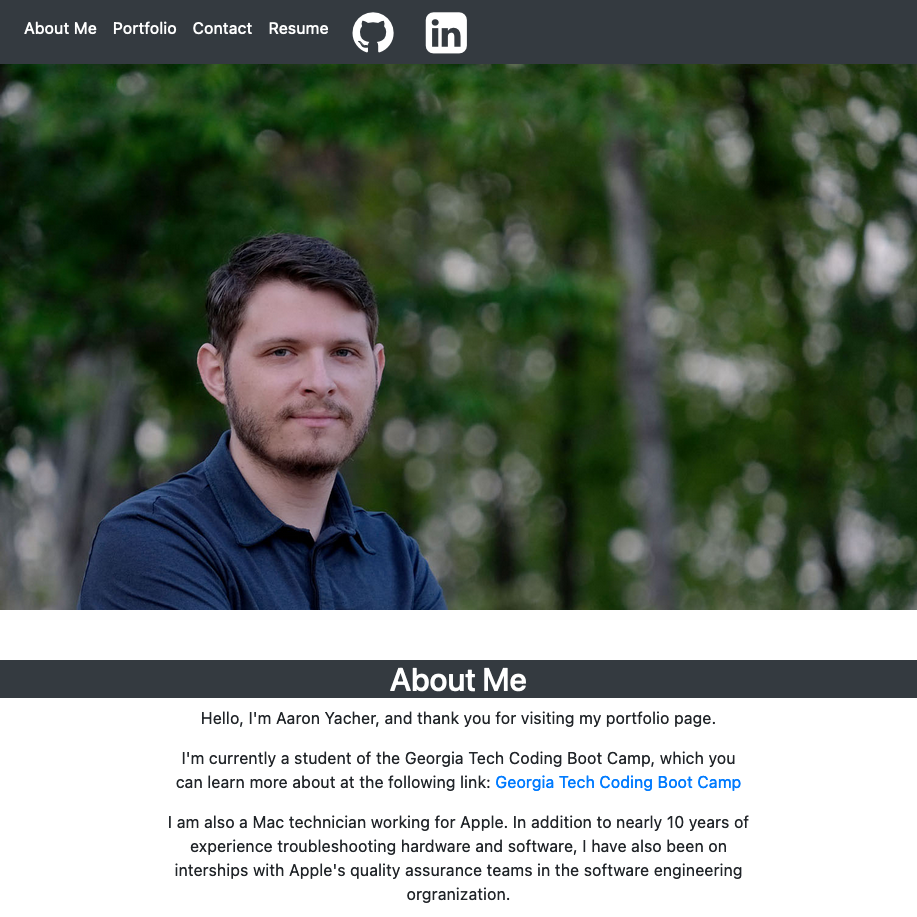

# The Portfolio of Aaron Yacher

  ## License
  
    
  The MIT License

  ## Description

This is the third iteration of my portfolio website.

Deployed Link: https://aalink.github.io/portfolio-aaron-yacher/

Repository Link: https://github.com/aalink/portfolio-aaron-yacher

For the sake of comparison, the first version can be viewed at the following links:

Deployed Link: https://aalink.github.io/02-advanced-css-portfolio/

Repository:  https://github.com/aalink/02-advanced-css-portfolio

  

## Table of Contents

- [Changes](#changes)
- [Usage](#usage)
- [Tests](#tests)

## Changes
One new group project has been added along with four homework assignments.

New project and homework pins have been added to the GitHub profile page.

Updates have been made to the downloadable resume.

## Usage
The link to the deployed link is near the top of this README.md file.

## Tests
This application with be tested manually through user input.
## Questions
If you have any questions or need to reach me:

GitHub: https://github.com/aalink

Email: aaronyacher@gmail.com
