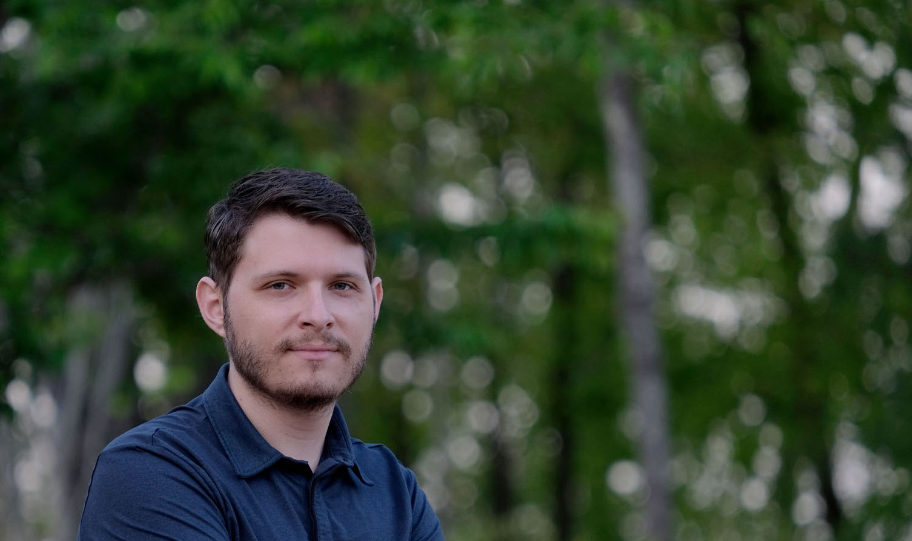

# portfolio-aaron-yacher

Deployed Link: https://aalink.github.io/portfolio-aaron-yacher/

Repository Link: https://github.com/aalink/portfolio-aaron-yacher


```
Then Next Step of an Evolution
```
This is the second iteration of my portfolio website. For the sake of comparison, the first version can be viewed at the following links:

Deployed Link: https://aalink.github.io/02-advanced-css-portfolio/

Repository:  https://github.com/aalink/02-advanced-css-portfolio




```
Challenges
```
The biggest change in my approach for this update, which resulted in being the primary challenge, was the use of [Bootstrap](https://getbootstrap.com/).  In the first version of the portfolio project, we were expected to create our own CSS to do both styling and responsive design. Bootstrap made the creation of a responsive design easier in several ways. However, figuring out how to use the large number of classes that are available consumed a considerable amount of time compared to other aspects of the project.
```
What I Learned
```
Since a good portion of my was spent on the Bootstrap website looking for ways to accomplish the layout I wanted, I believe this was a good exercise in learning how to use and search documentation.

In addition, it gave a new perspective on how to approach responsive layouts. For example, when using Bootstrap, you don't have to invest time into to making your own media queries.  The container system, along with setting up rows and columns, makes responsive design easy to set up without having to leave the HTML file.
```
Conclusion
```
When comparing this iteration of my website to the original design, the benefit of using a 3rd party library like Bootstrap was made clear. Although it took time to look through the documentation, using plain HTML and CSS would have taken more time to achieve the same result.